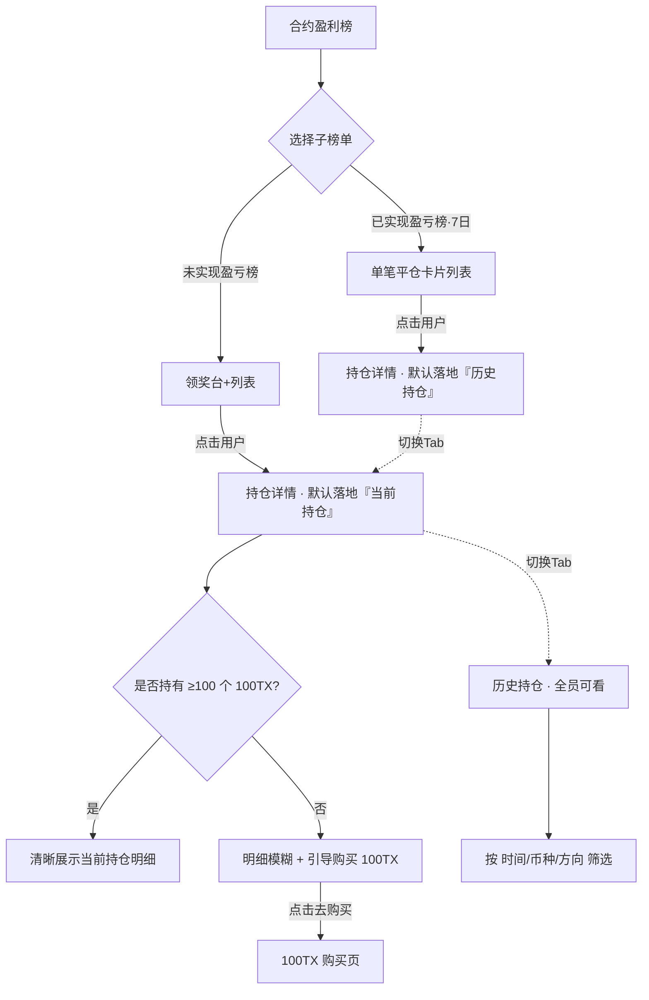
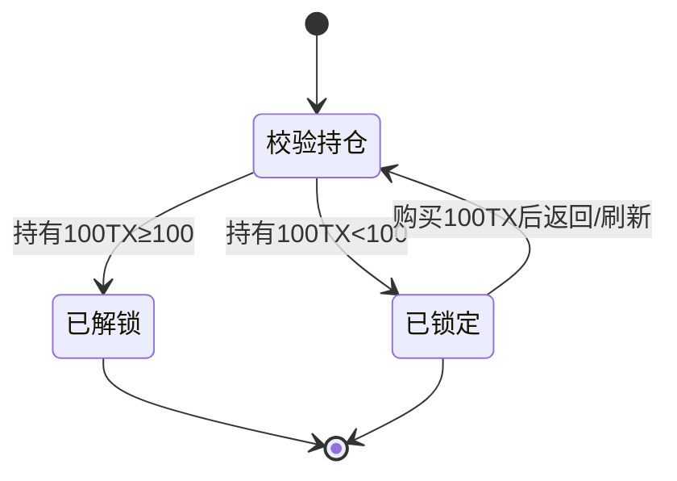

# 合约盈利榜 · 榜单用户持仓详情 PRD

| 版本 | 日期 | 修订人 | 备注 |
|---|---|---|---|
| V1.0 | 2026-08-09 | Rhys | 首版，含未实现/已实现双榜入口、持仓详情、100TX 持仓门禁 |

> 配套原型：`0807-榜单用户持仓详情.html`（可在 https://forclaudecode.vercel.app/0807-榜单用户持仓详情.html 预览）

---

## 一、概述

### 1.1 产品概述及目标

#### 1.1.1 背景介绍
合约盈利榜（未实现盈亏榜 / 已实现盈亏榜·7日）已上线，用户可看到榜单上高盈利交易者的 UID、币种、方向、杠杆与盈亏。但榜单是"结果展示"，用户无法进一步查看**上榜者的持仓明细**（开仓价、标记价、强平价等），缺少从"看到榜"到"研究策略/跟随交易"的承接路径，榜单价值未被充分释放。

同时，平台希望以持仓明细作为 **100TX 代币的核心权益场景**——通过"查看他人实时当前持仓需持有 100 个 100TX"来驱动代币需求与持仓沉淀。

#### 1.1.2 产品概述
在合约盈利榜基础上，为每个榜单用户增加**持仓详情页**，分「当前持仓」与「历史持仓」两个 Tab：
- **历史持仓**：所有用户免费可看；
- **当前持仓**：需持有 **100 个 100TX** 解锁；未达标时明细模糊处理并引导购买 100TX。

持仓明细中，**保证金、数量（及数量类字段）不展示**，以保护上榜者的仓位规模与资金体量，降低被反向狙击/抄底风险。

#### 1.1.3 产品目标
**业务目标**
- 100TX 代币新增持仓地址数 / 人均持仓量提升（核心）；[待确认] 具体目标值
- 榜单页 → 持仓详情页点击转化率 ≥ [待确认]%；
- 持仓详情页 → 100TX 购买页点击转化率 ≥ [待确认]%。

**用户目标**
- 快速查看高盈利交易者的开/平仓价位、方向、杠杆等可参考信息；
- 通过历史持仓评估交易者的稳定性与风格。

#### 1.1.4 目标用户
- **浏览型用户**：想研究高手策略、寻找跟单/交易参考的合约用户；
- **潜在 100TX 持有者**：对"解锁实时当前持仓"有付费/持币意愿的用户；
- **上榜用户（被展示方）**：其持仓被匿名展示（UID 脱敏）。

### 1.2 名词说明

| 名词 | 说明 |
|---|---|
| 未实现盈亏榜 | 基于当前持有仓位的浮动盈亏排名，每 5 分钟刷新 |
| 已实现盈亏榜·7日 | 基于近 7 日已平仓交易的已实现盈亏排名 |
| 当前持仓 | 用户当前持有中（未平仓）的仓位 |
| 历史持仓 | 用户已平仓 / 部分平仓的历史仓位记录 |
| 100TX | 平台代币，本功能中作为解锁"当前持仓"的持仓门槛资产 |
| 持仓门禁 | 需持有指定数量 100TX 才能查看当前持仓的准入机制 |
| 数量类字段 | 暴露仓位规模的字段：数量、保证金、最大持仓量、已平仓量等 |

### 1.3 角色及权限

| 角色 | 历史持仓 | 当前持仓 | 数量/保证金字段 |
|---|---|---|---|
| 未持有 100TX 的登录用户 | ✅ 可看 | ❌ 模糊+引导购买 | ❌ 全隐藏 |
| 持有 ≥100 个 100TX 的登录用户 | ✅ 可看 | ✅ 可看 | ❌ 仍隐藏 |
| 未登录游客 | [待确认] 是否允许浏览 | ❌ | ❌ |
| 上榜用户本人 | [待确认] 是否可见自己完整数据/是否可关闭被展示 | — | — |

> 注：数量与保证金对**所有角色**均不展示，与是否持有 100TX 无关。100TX 仅控制"当前持仓"整体的可见性。

### 1.4 文档阅读对象
产品、前端、后端、测试、UED、运营（100TX 增长）。

---

## 二、产品描述

### 2.1 产品需求描述
1. 合约盈利榜两个子榜单（未实现 / 已实现）均支持点击任一榜单用户进入其**持仓详情页**。
2. 持仓详情页含「当前持仓」「历史持仓」两个 Tab，及顶部用户盈亏摘要。
3. 持仓明细字段展示遵循"**除保证金、数量外全部展示**"规则。
4. 「历史持仓」全员可看，支持时间 / 币种 / 方向筛选。
5. 「当前持仓」需持有 100 个 100TX 才可查看；未达标时明细高斯模糊 + 覆盖引导购买。
6. 详情页顶部摘要与默认落地 Tab 依据**来源榜单**动态适配。

### 2.2 产品整体流程

#### 主流程（Mermaid）


#### 状态转换图 · 当前持仓门禁（Mermaid）


### 2.3 全局说明

**异常处理**
- 数据加载失败：Tab 内展示"加载失败，点击重试"占位。
- 无数据：当前/历史持仓为空时展示空状态文案（如"该用户暂无持仓"/"该筛选条件下暂无历史持仓"）。
- 持仓校验接口失败：默认按**未解锁**处理（从严），避免越权展示。[假设]

**列表规则**
- 历史持仓默认按最后平仓时间倒序；[假设]
- 历史持仓默认时间范围为近 1 个月；[假设]
- 分页/滚动加载策略 [待确认]（建议每页 20 条，触底加载）。

**全局交互**
- 盈亏为正绿色、为负红色；方向多=绿、空=红。
- UID 全程脱敏展示（如 `UID 10****60`）。

### 2.4 产品版本规划
- **V1.0（本期）**：双榜入口点击、持仓详情双 Tab、字段隐藏规则、100TX 持仓门禁、历史筛选。
- **V1.1（规划）**：已实现榜进入时在历史列表高亮/置顶"上榜的那笔交易"；当前持仓实时刷新（WebSocket）；一键跟单/关注入口。[待确认]

### 2.5 产品框架
```
合约盈利榜
├── 未实现盈亏榜（领奖台样式）
├── 已实现盈亏榜·7日（单笔平仓卡片）
└── 持仓详情页
    ├── 顶部用户盈亏摘要（随来源适配）
    ├── Tab：当前持仓（100TX 门禁）
    └── Tab：历史持仓（全员可看 + 筛选器）
```

### 2.6 功能清单

| 编号 | 功能模块 | 说明 | 优先级 |
|---|---|---|---|
| F1 | 榜单入口与点击绑定 | 双榜单可切换，卡片可点击进入详情 | P0 |
| F2 | 持仓详情 - 顶部摘要 | 随来源适配盈亏口径与标签 | P0 |
| F3 | 当前持仓 Tab | 字段展示 + 100TX 门禁模糊/引导 | P0 |
| F4 | 历史持仓 Tab | 字段展示 + 时间/币种/方向筛选 | P0 |
| F5 | 100TX 持仓校验与购买跳转 | 校验持仓、跳转购买页 | P0 |

---

## 三、功能需求

### F1 榜单入口与点击绑定

**描述**：合约盈利榜含两个子榜单，可切换；任一榜单用户卡片可点击进入其持仓详情。

**用户故事**：作为浏览用户，我希望点击榜单上的高手，以便查看他的持仓明细。

**前置条件**：已进入合约盈利榜页面。
**后置条件**：进入对应用户的持仓详情页。

**界面及交互**
- 顶部两个 Tab：`未实现盈亏榜` / `已实现盈亏榜·7日`，点击切换，选中态高亮。
- 未实现盈亏榜：前 3 名领奖台 + 4 名起列表；卡片展示 UID、币种、方向、杠杆、未实现盈亏、收益率。
- 已实现盈亏榜：单笔平仓卡片列表；卡片展示排名奖牌、UID、币种、方向、杠杆、开仓价、平仓价、已实现盈亏、收益率。
- 点击任一卡片 → 进入持仓详情。

**跳转规则（关键）**

| 来源榜单 | 默认落地 Tab | 说明 |
|---|---|---|
| 未实现盈亏榜 | 当前持仓 | 未实现盈亏对应持有中仓位，落地当前持仓，命中 100TX 转化点 |
| 已实现盈亏榜·7日 | 历史持仓 | 已实现盈亏对应已平仓交易，落地历史持仓（全员可看） |

**异常/分支流程**
- 榜单数据为空：展示空榜占位。
- 该用户账号异常/已注销：进入后展示"用户数据不可用"。[假设]

---

### F2 持仓详情 - 顶部用户盈亏摘要

**描述**：详情页顶部展示被查看用户的身份与盈亏摘要，随来源榜单动态切换口径。

**界面及交互**

| 来源 | 来源标签 | 盈亏标签 | 数值 |
|---|---|---|---|
| 未实现榜 | 合约盈利榜 · 未实现盈亏榜 | 未实现盈亏 (USDT) | 该用户未实现盈亏 / 收益率 |
| 已实现榜 | 合约盈利榜 · 已实现盈亏榜·7日 | 已实现盈亏 · 7日 (USDT) | 该用户 7 日已实现盈亏 / 收益率 |

- 展示脱敏 UID、排名奖牌。
- 盈亏正绿负红。

---

### F3 当前持仓 Tab（100TX 门禁）

**描述**：展示用户当前持有中的仓位明细，需持有 100 个 100TX 解锁。

**用户故事**：作为持有 100TX 的用户，我希望查看高手当前的开仓/标记/强平价与保证金比率，以便研究其实时仓位。

**前置条件**：进入持仓详情页并切至/落地"当前持仓"。
**后置条件**：达标→清晰展示；未达标→模糊+引导。

**展示字段（每个持仓卡片）**

| 字段 | 是否展示 | 说明 |
|---|---|---|
| 币种 / 合约类型（永续）/ 保证金模式（全仓/逐仓）/ 杠杆 | ✅ | 卡片头部标签 |
| 方向（多/空） | ✅ | |
| 未实现盈亏 (USDT) | ✅ | |
| 收益率 | ✅ | |
| 开仓价格 | ✅ | |
| 标记价格 | ✅ | |
| 强平价格 | ✅ | |
| 保证金比率 | ✅ | 百分比，不暴露本金 |
| **数量** | ❌ 隐藏 | 数量类字段 |
| **保证金 (USDT)** | ❌ 隐藏 | 资金体量 |

**门禁交互（方案 B：指定账户校验）**

设 `资金账户持仓 = spot`，门槛 `REQ = 100`。仅当 **`spot ≥ REQ`（100TX 在指定校验账户）** 才解锁。

| 状态 | 条件 | 展示 |
|---|---|---|
| 解锁 | spot ≥ 100 | 清晰展示，Tab 无锁标 |
| 未达标 | spot < 100 | 明细整体**高斯模糊**（不可选中/复制），Tab 带 🔒；覆盖引导层含锁 icon + 文案「资金账户需持有 **100 100TX** · 你当前持有 **{spot}**」+ **固定两个按钮：【去购买 100TX】（主）/【去划转 100TX】（次）** |

> 说明：未达标时不做条件分支，统一同时提供"购买 / 划转"两个入口，由用户自行选择（没有 100TX 就购买，其他账户有就划转）。

**异常/分支流程**
- 该用户当前无持仓：展示空状态"该用户暂无当前持仓"（达标用户才可见此结论；未达标仍展示门禁）。[假设]
- 持仓校验接口超时/失败：按未解锁处理并可重试。
- 用户购买 100TX 后返回：需**重新校验持仓并自动解除模糊**（返回即刷新或下拉刷新）。[待确认] 刷新时机

---

### F4 历史持仓 Tab（全员可看）

**描述**：展示用户已平仓/部分平仓的历史仓位，所有用户免费可看，支持筛选。

**前置条件**：进入持仓详情页。
**后置条件**：展示筛选后的历史持仓列表。

**展示字段（每个历史卡片）**

| 字段 | 是否展示 | 说明 |
|---|---|---|
| 币种 / 合约类型 / 保证金模式 | ✅ | |
| 平仓状态（部分平仓/全部平仓） | ✅ | |
| 开仓价格 | ✅ | |
| 平仓均价 | ✅ | |
| 已实现盈亏 (USDT) | ✅ | 正绿负红 |
| 方向（多/空） | ✅ | 作为卡片头部方向标签展示（多绿/空红），不再单列"方向/杠杆"字段 |
| 开仓时间 / 最后平仓时间 | ✅ | |
| **最大持仓量** | ❌ 隐藏 | 数量类字段 [待确认] 是否保留 |
| **已平仓量** | ❌ 隐藏 | 数量类字段 [待确认] 是否保留 |

**筛选器交互**
- 三个筛选器：`时间范围` / `币种` / `方向`，点击弹出底部选择面板（bottom sheet）。
- 时间范围：近7天 / 近1个月 / 近3个月 / 全部；[假设] 预设值
- 币种：全部 + 该用户历史出现过的币种；
- 方向：全部 / 多 / 空；
- 选中非"全部"值时筛选器高亮；实时筛选列表；无结果展示空状态。

**异常/分支流程**
- 无历史持仓：空状态"该用户暂无历史持仓"。
- 筛选无匹配：空状态"该筛选条件下暂无历史持仓"。

---

### F5 100TX 持仓校验与购买跳转

**描述**：按**方案 B（指定账户校验）**校验用户在指定账户的 100TX 持仓量，未达标时统一提供购买 / 划转两个入口。

**业务规则**
- 校验账户：仅校验**资金账户**的 100TX 持仓；其他账户（现货/合约/理财等）不计入解锁判定。
- 阈值：指定账户持仓 `spot ≥ 100` 即解锁；[待确认] "当前快照"还是"持续持有"。
- 未达标按钮：固定同时展示 **【去购买 100TX】（主）/【去划转 100TX】（次）**，不做条件分支，由用户自行选择。
- 校验时机：进入当前持仓 Tab 时；购买/划转返回时；下拉刷新时。
- 【去购买 100TX】跳转目标：[待确认] 100TX 现货/兑换购买页 URL。
- 【去划转 100TX】跳转目标：账户划转页，默认「转出=其他账户、转入=指定账户、币种=100TX、数量=建议补足额」。[待确认] 是否预填数量

**异常/分支流程**
- 未登录点击"去购买/去划转"：先走登录流程。[假设]
- 校验接口失败：按未解锁处理。
- 划转/购买返回后：重新校验，`spot ≥ 100` 则自动解除模糊。

---

## 四、非功能需求

### 4.1 安全与合规
- 所有被展示用户 UID 必须脱敏（`10****60` 形式）。
- 数量、保证金等资金体量字段服务端即不下发给前端（而非仅前端隐藏），避免抓包越权。**（强约束）**
- 未解锁当前持仓时，服务端不下发当前持仓明细数据，前端模糊仅为视觉占位。**（强约束，防抓包）**
- [待确认] 展示他人持仓是否需被展示方授权/提供关闭开关（隐私合规）。

### 4.2 统计需求（埋点）

| 事件名 | 触发时机 | 关键属性 |
|---|---|---|
| leaderboard_tab_switch | 切换未实现/已实现榜 | tab_type |
| leaderboard_user_click | 点击榜单用户 | source(unreal/real), rank, uid_masked, symbol |
| position_detail_view | 进入持仓详情 | source, landing_tab |
| position_tab_switch | 切换当前/历史 Tab | tab, has_token |
| current_position_locked_view | 当前持仓门禁曝光 | uid_masked, hold_amount |
| buy_100tx_click | 点击去购买 100TX | from=position_detail |
| history_filter_apply | 应用历史筛选 | filter_type, filter_value |
| position_load_error | 数据加载失败 | tab, error_code |

### 4.3 性能需求
- 详情页首屏加载 ≤ [待确认]（建议 1.5s）。
- 100TX 持仓校验接口响应 ≤ [待确认]（建议 500ms）。
- 当前持仓标记价格/未实现盈亏刷新频率 [待确认]（建议与榜单一致或 WebSocket 实时）。

### 4.4 数据字典（前端展示模型）

**当前持仓 CurrentPosition**

| 字段 | 类型 | 必填 | 说明 | 示例 |
|---|---|---|---|---|
| symbol | string | 是 | 币种 | BTCUSDT |
| contractType | string | 是 | 合约类型 | 永续 |
| marginMode | string | 是 | 保证金模式 | 全仓/逐仓 |
| leverage | int | 是 | 杠杆 | 30 |
| side | enum | 是 | 方向 | long/short |
| unrealizedPnl | decimal | 是 | 未实现盈亏 | 11383.12 |
| roe | decimal | 是 | 收益率% | 66.34 |
| entryPrice | decimal | 是 | 开仓价 | 62914.04 |
| markPrice | decimal | 是 | 标记价 | 64336.93 |
| liqPrice | decimal | 是 | 强平价 | 62855.31 |
| marginRatio | decimal | 是 | 保证金比率% | 16.14 |
| ~~quantity~~ | — | — | **不下发** | — |
| ~~margin~~ | — | — | **不下发** | — |

**历史持仓 HistoryPosition**

| 字段 | 类型 | 必填 | 说明 | 示例 |
|---|---|---|---|---|
| symbol / contractType / marginMode | string | 是 | 同上 | ETHUSDT |
| closeStatus | enum | 是 | 平仓状态 | partial/all |
| entryPrice | decimal | 是 | 开仓价 | 1910.81 |
| avgClosePrice | decimal | 是 | 平仓均价 | 1861.80 |
| realizedPnl | decimal | 是 | 已实现盈亏 | 23209.85 |
| side / leverage | — | 是 | 方向/杠杆 | short/全仓 |
| openTime / lastCloseTime | datetime | 是 | 开仓/最后平仓时间 | 2026-07-30 09:46:08 |
| ~~maxPositionSize / closedQty~~ | — | — | **不下发** [待确认] | — |

**持仓校验 TokenGateCheck**

| 字段 | 类型 | 说明 |
|---|---|---|
| requiredAccount | string | 校验账户，固定为 funding（资金账户） |
| fundingAmount | decimal | 资金账户的 100TX 持仓量（= 解锁判定依据） |
| otherAmount | decimal | 其他账户合计 100TX 持仓量（供用户判断可否划转） |
| threshold | int | 门槛，=100 |
| unlocked | bool | 是否解锁当前持仓（= spotAmount ≥ threshold） |

### 4.5 系统集成
- 合约持仓服务：提供当前/历史持仓明细（按可见性裁剪字段）。
- 代币资产服务：提供 100TX 持仓量。
- 100TX 购买页：跳转承接。
- 埋点系统：上报上述事件。

---

## 五、附录

### 5.1 验收标准与测试要点

| # | 验收条件 |
|---|---|
| 1 | 两个子榜单可切换，选中态正确；各自卡片布局符合设计 |
| 2 | 点击未实现榜用户 → 进入详情且默认落地"当前持仓"；顶部显示"未实现盈亏" |
| 3 | 点击已实现榜用户 → 进入详情且默认落地"历史持仓"；顶部显示"已实现盈亏·7日" |
| 4 | 任何角色在任何 Tab 下均看不到数量、保证金字段（且接口不下发） |
| 5 | 未持有 100 个 100TX：当前持仓明细模糊、不可复制、展示引导层与"去购买"按钮 |
| 6 | 持有 ≥100 个 100TX：当前持仓清晰展示，Tab 无锁标 |
| 7 | 历史持仓对所有登录用户可见，无需持仓 |
| 8 | 历史筛选（时间/币种/方向）实时生效，选中态高亮，无结果显示空状态 |
| 9 | 购买 100TX 返回后当前持仓自动解锁（无需手动重进） |
| 10 | 抓包验证：未解锁时接口不返回当前持仓明细数据 |

---

## 待确认项清单

### 必须确认（阻塞开发）
1. [待确认] 方案 B 校验账户已定为**资金账户**；仍需确认：判定按"当前快照"还是"持续持有"？划转页是否预填补足数量？→ F5
2. [待确认] 未解锁时服务端是否完全不下发当前持仓明细（防抓包）→ 4.1（建议：是）
3. [待确认] 数量/保证金以外，历史的"最大持仓量/已平仓量"是否也隐藏 → F4 / 4.4（原型已隐藏，需业务拍板）
4. [待确认] 未登录游客是否允许浏览历史持仓 → 1.3
5. [待确认] 【去购买 100TX】跳转目标页 URL → F5
6. [假设→需确认] 持仓校验失败时按"未解锁"从严处理 → 2.3 / F5

### 建议确认（影响完整度）
7. [待确认] 上榜用户（被展示方）隐私：是否需授权/关闭开关 → 4.1
8. [待确认] 当前持仓刷新频率（实时 WebSocket / 5 分钟 / 静态快照）→ 4.3
9. [待确认] 购买 100TX 返回后的刷新时机（自动/下拉）→ F3
10. [假设→需确认] 历史持仓默认排序（最后平仓时间倒序）与默认时间范围（近 1 个月）→ 2.3

### 可后续补充
11. [待确认] V1.1 是否做"已实现榜进入时高亮/置顶上榜那笔交易" → 2.4
12. [待确认] 历史持仓分页策略（建议每页 20 触底加载）→ 2.3
13. [待确认] 各项性能指标目标值 → 4.3
